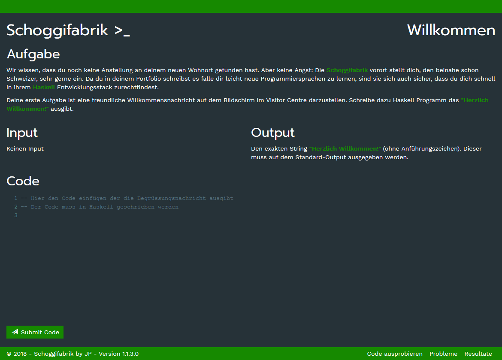

# Schoggifabrik

A puzzle project: Write haskell code that fulfills the requirements to clear each level.

The problems should be straight forward for someone who already knows their way around haskell.

## Screenshots

## Requirements

* Docker
* A bash shell that has docker in its PATH variable
  * Set the environment variable `SCHOGGIFABRIK:SHELL` or `SCHOGGIFABRIK__SHELL` to the path of the target shell

## Tested on

* Windows 10
  * docker 18.03.0-ce
  * git 2.17.0.windows.1 (C:\Program Files\Git\usr\bin\bash.exe as SCHOGGIFABRIK:SHELL)
* Ubuntu 16.04 LTS
  * docker 17.12.0-ce

## Credits

Checkmark Graphic and Animation: [https://codepen.io/haniotis/pen/KwvYLO](https://codepen.io/haniotis/pen/KwvYLO)
